# LabelLens — Solution Verification & Feature Strategy Matrix

> **SIH 2026 | Problem Statement ID: 26034**  
> **Ministry of Consumer Affairs, Food & Public Distribution | Department of Consumer Affairs (DoCA)**  
> **Topic:** Automatic Legal Metrology (Packaged Commodities) Rules, 2011 Compliance Checking System

---

##  EXECUTIVE VERDICT

> [!NOTE]
> **VERDICT: YES, THE PROPOSED SOLUTION FULLY MEETS AND EXCEEDS ALL MANDATORY REQUIREMENTS.**

The proposed architecture moves far beyond the "predictable baseline" (generic single-image OCR + regex) by introducing **spatial layout localization**, **fiducial unit-scale calibration**, **config-driven LMPC rules engine**, **bilingual Indic extraction**, **LLM semantic reasoning**, and **cryptographic chain-of-custody**.

---

## 1. MANDATORY REQUIREMENTS VERIFICATION MATRIX

| Mandatory Functional Requirement | Proposed Solution Capability | Implementation Status in LabelLens | Compliance Status |
|---|---|---|---|
| **Image Upload & Product Scanning** | Multi-surface panning/capture, offline camera flow with SQLite caching, web listing scraper. | `VisionInspector.jsx`, `scrapers/ecommerce.py`, React Native camera capture. | ✅ **FULL PASS** |
| **Mandatory Declarations Detection** | Two-stage pipeline: YOLOv8 region detection (PDP, MRP, Net Qty, Mfg Date, Consumer Care) + PaddleOCR extraction per crop. | `Rule6Engine.jsx`, YOLOv8 bounding boxes, PaddleOCR bilingual extraction. | ✅ **FULL PASS** |
| **Correctness, Completeness & Placement** | Placement rules validation (Rule 8: PDP presence of Net Qty & MRP), mandatory field checklist under Rule 6(1). | `Rule6Engine.jsx` PDP spatial validation, `lmpc_rules_v1.json` field checklists. | ✅ **FULL PASS** |
| **Missing/Non-Compliant Detection** | Relational config-driven rule engine + LLM semantic pass for misleading footnotes/asterisks/contradictions. | `RuleEngineSandbox.jsx`, prohibited word filter, LLM semantic contradiction engine. | ✅ **FULL PASS** |
| **Readability & Font Size Analysis** | **Optical Fiducial Reference Calibration** (5-Rupee coin = 23.0mm) to calculate pixel-to-mm ratio & compare print height against Rule 7 slabs. | `VisionInspector.jsx` coin reference sandbox, dynamic Rule 7 slab height calculations (1mm, 2mm, 4mm, 6mm). | ✅ **FULL PASS** |
| **Compliance Reports & Summaries** | Digital compliance reports with per-field verdicts, confidence bars, and exact legal clause citations. | `Rule6Engine.jsx`, `ConfidenceBar.jsx`, `lmpc_rules_v1.json` rule citations. | ✅ **FULL PASS** |
| **Repository & Inspection History** | PostgreSQL database with immutable scan logs, S3 object storage for evidence images, searchable audit logs. | `models.py` ScanRecord ORM, evidence image storage, district history query engine. | ✅ **FULL PASS** |
| **Enforcement Official Dashboards** | Heatmap monitor across metropolitan districts, live quick-commerce monitoring stream, national violation tracking. | `HeatmapMonitor.jsx`, district violation heatmaps, live scraping stream UI. | ✅ **FULL PASS** |
| **Rule-Based LMPC 2011 Checking** | Versioned JSON/YAML configuration file (`lmpc_rules_v1.json`) allowing zero-code updates for regulatory amendments. | `lmpc_rules_v1.json`, dynamic font slab resolver, prohibited expressions matcher. | ✅ **FULL PASS** |
| **Report Export (PDF / Editable)** | **Section 39 Statutory Show-Cause Notice Generator** (WeasyPrint HTML-to-PDF & DOCX) with embedded proof & citations. | `NoticeGenerator.jsx`, print-ready notice templates, downloadable report evidence. | ✅ **FULL PASS** |
| **Role-Based Access & Security** | Role-based access control (Inspector, Officer, Ministry Admin) + **Cryptographic Chain-of-Custody** (SHA-256 digest, GPS, NTP timestamp). | `NoticeGenerator.jsx` SHA-256 evidence block, JWT role verification. | ✅ **FULL PASS** |

---

## 2. FEATURE CLASSIFICATION & IMPLEMENTATION STRATEGY

Below is the evaluation of the **14 advanced features** categorized by current codebase implementation, high-priority additions, and strategic pitch highlights.

```mermaid
graph TD
    A["Proposed Advanced Features (1-14)"] --> B["Group A: Currently Implemented in Codebase"]
    A --> C["Group B: Must-Implement for Final Demo"]
    A --> D["Group C: High-Value Pitch & Vision Differentiators"]

    B --> B1["#1 QR-Code 2022 Amendment Proviso"]
    B --> B2["#2 Physical vs. E-Commerce Dual-Mode"]
    B --> B5["#5 Rule-Citation Grounded Explainability"]
    B --> B7["#7 Confidence Escalation (Pass/Review/Fail)"]
    B --> B10["#10 DoCA e-Maapan / Show-Cause Sync"]
    B --> B14["#14 Hybrid CV-OCR + LLM Architecture"]

    C --> C1["#3 Approved-Artwork Drift Detection"]
    C --> C2["#6 Synthetic Adversarial Label Generator"]
    C --> C3["#9 Dark-Pattern & Shrinkflation Tracker"]
    C --> C4["#12 Active Learning Feedback Loop"]

    D --> D1["#4 Physical vs. Declared Quantity Fusion"]
    D --> D2["#8 GS1 Digital Link 2027 Readiness"]
    D --> D3["#11 Offline Edge Small VLM"]
    D --> D4["#13 Economic Framing Pitch"]
```

---

### GROUP A: ALREADY IMPLEMENTED IN YOUR CODEBASE & FRAMEWORK

| Feature | Feature Name | Why it's a Massive Differentiator | Codebase Location |
|---|---|---|---|
| **#1** | **QR-Code Declaration Compliance (2022/2023 Amendment)** | Correctly validates that electronics can push manufacturer details to QR codes while keeping MRP, Net Qty, Mfg Date, and Consumer Care printed on-pack. Prevents false positive non-compliance flags. | [`Rule6Engine.jsx`](file:///Users/pushpakmali/Projects/Label-Lens/src/components/Rule6Engine.jsx), [`README.md`](file:///Users/pushpakmali/Projects/Label-Lens/README.md) |
| **#2** | **E-Commerce vs. Physical Dual-Mode Checker** | Applies standard Rule 6(1) to physical packages and digital disclosure rules under Rule 6(10) + Rule 6(10A) (country of origin sorting) to online listings. | [`Rule6Engine.jsx`](file:///Users/pushpakmali/Projects/Label-Lens/src/components/Rule6Engine.jsx), [`label_lens_framework.md`](file:///Users/pushpakmali/Projects/Label-Lens/label_lens_framework.md) |
| **#5** | **Rule-Citation-Grounded Explainability** | Automatically attaches statutory clause citations (e.g. `Rule 6(1)(a)`, `Rule 7 Table 1`, `Section 39`) to every detected violation. | [`lmpc_rules_v1.json`](file:///Users/pushpakmali/Projects/Label-Lens/src/data/lmpc_rules_v1.json), [`NoticeGenerator.jsx`](file:///Users/pushpakmali/Projects/Label-Lens/src/components/NoticeGenerator.jsx) |
| **#7** | **Confidence-Calibrated Escalation** | Replaces binary Pass/Fail with Pass / Needs-Human-Review / Fail. Low confidence OCR outputs (<75%) route automatically to inspector queues. | [`ConfidenceBar.jsx`](file:///Users/pushpakmali/Projects/Label-Lens/src/components/ConfidenceBar.jsx), [`RuleEngineSandbox.jsx`](file:///Users/pushpakmali/Projects/Label-Lens/src/components/RuleEngineSandbox.jsx) |
| **#10** | **DoCA e-Maapan / Show-Cause Notice Sync** | Auto-compiles an official Department of Consumer Affairs Show-Cause Notice complete with embedded photo evidence, citations, and 15-day directive. | [`NoticeGenerator.jsx`](file:///Users/pushpakmali/Projects/Label-Lens/src/components/NoticeGenerator.jsx) |
| **#14** | **Hybrid Detector + Reasoning Architecture** | Uses CV/OCR (YOLOv8 + PaddleOCR) for fine-grained pixel extraction, delegating legal reasoning and contradiction detection to an LLM pass. | [`label_lens_framework.md`](file:///Users/pushpakmali/Projects/Label-Lens/label_lens_framework.md) Stage 1 vs Stage 5 |

---

### GROUP B: MUST-IMPLEMENT FOR THE FINAL HACKATHON DEMO

| Feature | Feature Name | Implementation Recommendation | Expected Impact |
|---|---|---|---|
| **#3** | **Approved-Artwork Drift Detection** | Add a visual comparison module (perceptual hashing / SSIM pixel diff) comparing scanned label against manufacturer's registered artwork to flag sticker overlays & MRP tampering. | Turns compliance checker into a high-value **anti-counterfeit & fraud detection engine**. |
| **#6** | **Synthetic Adversarial Label Generator** | Create a script generating edge-case labels (undersized 0.8mm font, `"net wt when packed"`, misleading footnotes) to prove low false-negative rates in presentation slides. | Demonstrates **unmatched engineering rigor** to technical judges. |
| **#9** | **Dark-Pattern / Shrinkflation Tracker** | Track SKU net quantity and MRP history over time across scraped e-commerce listings to catch silent quantity drops at equal prices. | Directly addresses modern consumer protection issues actively monitored by DoCA. |
| **#12** | **Active Learning Feedback Loop** | Include an interactive UI toggle where inspector corrections automatically store fine-tuning pairs for model retraining. | Proves the platform is a **self-improving system** rather than a static model. |

---

### GROUP C: HIGH-VALUE VISION & PITCH HIGHLIGHTS (PITCH/THINK OF)

| Feature | Feature Name | How to Position in Pitch | Why Judges Will Love It |
|---|---|---|---|
| **#4** | **Physical-vs-Declared Quantity Fusion** | Highlight how pairing vision with container volume estimation or weight sensors aligns with the **Sixth Schedule (net quantity verification)**. | Demonstrates deep domain knowledge of actual Weights & Measures laws. |
| **#8** | **GS1 Digital Link Readiness (2027)** | Show QR parser expanding standard URLs into GS1 Digital Link parameters (GTIN, batch, expiry, recall status). | Shows system is **future-proofed** for international retail evolution. |
| **#11** | **On-Device / Offline Edge VLM** | Emphasize React Native offline storage + quantized edge vision execution for remote warehouse inspection. | Solves real-world connectivity limitations in Tier-2/3 India. |
| **#13** | **Economic Framing Narrative** | **Pitch Opener:** "India has over 10M retail SKUs updated annually, but fewer than 5,000 active field inspectors. LabelLens scales inspection capacity by 100x." | Establishes immediate business case and real-world scale before technical details. |

---

## 3. SUMMARY OF CORE DIFFERENTIATORS THAT WILL WIN THE HACKATHON

1. **Millimeter Accuracy via Fiducial Calibration:** Solves font-size measurement using reference coins (5-Rupee coin = 23mm) rather than guessing pixel counts.
2. **2022 QR Code Proviso Intelligence:** Knows which mandatory fields can legally move to QR codes for electronics and which *must* stay printed on-pack.
3. **Legal Chain-of-Custody:** SHA-256 cryptographic hashing + NTP timestamp + GPS coordinates embedded in every Show-Cause Notice for courtroom admissibility.
4. **Config-Driven Architecture (`lmpc_rules_v1.json`):** Allows DoCA officials to update regulatory rules without redeploying software code.
5. **E-Commerce Quick-Commerce Scraping Stream:** Extends enforcement beyond physical retail to online platforms (Rule 6(10) & 6(10A)).
